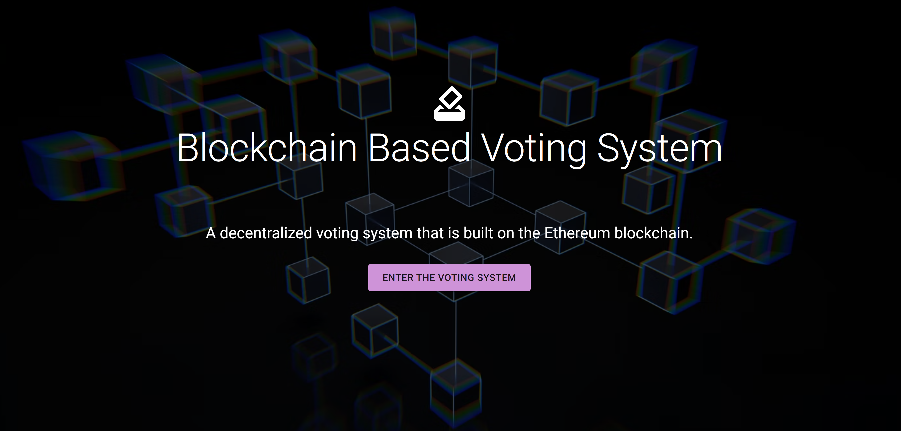
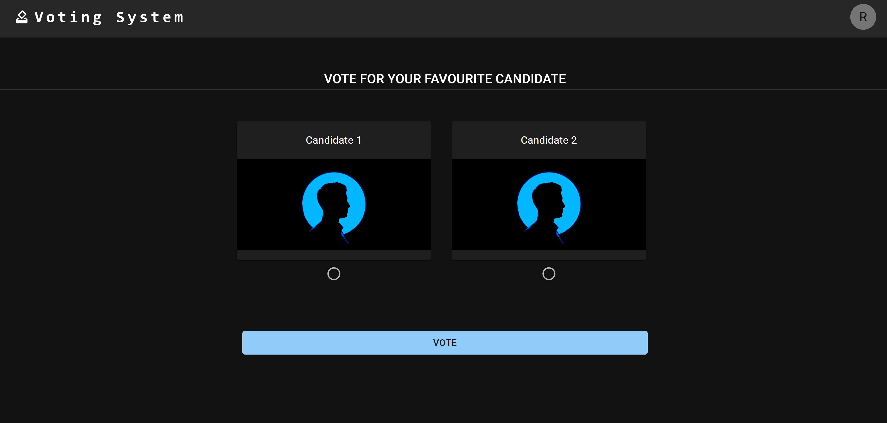
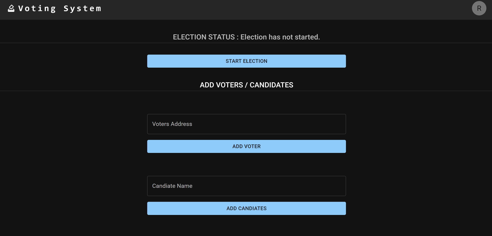

# Block-Chain Based Voting System

This project is blockchain based voting app created in React and Solidity.

## Project Description

“Blockchain Based Voting System” is a web based online voting system primarily based on ethereum blockchain technology. Blockchain is a shared, immutable ledger that facilitates the process of recording transactions and tracking assets in a business network. Here anyone eligible for voting can vote for their favorite candidate and they can see the result after the end of the election. It is fast, secure, and has low cost as compared to traditional voting systems. Some key features of our system are:

a) Decentralized & Transparent

b) Trustless

c) Immutable

This project is a simple implementation of a voting system done to understand the basics of ethereum blockchain technology and the working mechanism of decentralized application made in Solidity and React. Here, one account who deploys the smart contract is the Admin/manager and he/she can add voters and candidates that are eligible to cast the vote.  Then, the admin starts the election and eligible voters can vote for their favorite candidate. Finally, when admin ends the election, the voters can immediately see the final result of the election.

## Screenshots

 &nbsp;
 &nbsp;
 &nbsp;

## Installation

### Step 1. Clone the project

```git clone https://github.com/Vsjangal/Voting_App.git```

### Step 2. Start Ganache

Open the Ganache GUI client to start the local blockchain instance.

### Step 3. Compile & Deploy Election Smart Contract

```truffle compile
```truffle migrate

```truffle migrate --reset```

We must migrate the election smart contract each time restart ganache or we want to held another election.

### Step 4. Configure Metamask

- Unlock Metamask
- Connect metamask to the local Etherum blockchain provided by Ganache.
- Import an account provided by Ganache.
- Refer this documentation if you are unable to connect <https://www.geeksforgeeks.org/how-to-set-up-ganche-with-metamask/#:~:text=Ganache%20CLI,on%20the%20ganache%20blockchain%20successfully.>

### Step 5. Run the Front End Application

```Vscode terminal
cd client
npm install
npm start
```

Visit URL in your browser: <http://localhost:3000>
